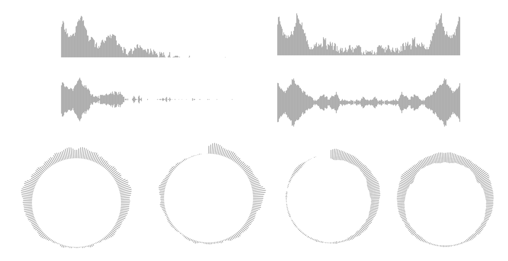
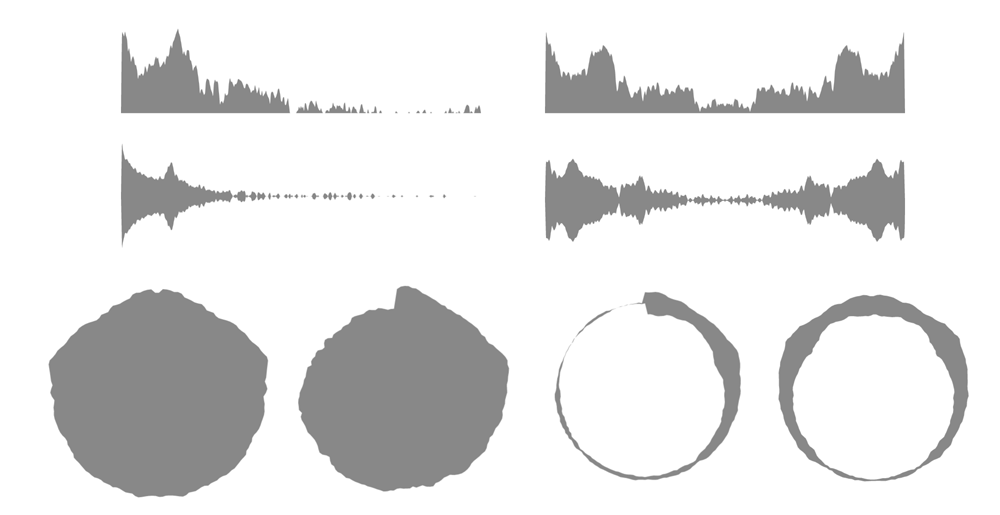

# FrequencySpectrum
Frequency Spectrum(Java) Library for visualizing frequencies
 

## Add to your project
Add the jitpack maven repository
```
allprojects {
  repositories {
    ...
    maven { url 'https://jitpack.io' }
  }
}
``` 
Add the dependency
```
dependencies {
  implementation 'com.github.slaviboy:FrequencySpectrum:v0.1.0'
}
```


## Example

#### Create Analyser View
Set up your Analyser View using **xml**
```xml
<com.slaviboy.analyser.AnalyserView
  android:id="@+id/analyser_view"
  android:layout_width="match_parent"
  android:layout_height="match_parent" />
```

#### Create drawer object
You can choose from one of the two available drawer classes:
* BarsDrawer
* CurvesDrawer

### BarsDrawer
Class that draws frequencies as bars(rectangles)


You can create bars drawer using the constructor by setting all available properties or
use the builder class, to set certain properties and leave the rest to default.

Example, how to create drawer with all available properties using **java**  
(for your project, set only the properties you like)

```JAVA
// create bars drawer using builder class 
BarsDrawer barsDrawer = new BarsDrawer.Builder()
   .withFillColor(Color.WHITE)
   .withMirrored(true)
   .withBarsWidth(2)
   .withSpacing(1)
   .withCornerRadius(4)
   .withRange(0, Integer.MAX_VALUE)
   .withIncreasePeaks(0)
   .withSensitivity(1)
   .withPosition(0, 0)
   .withPadding(0, 0, 0, 0)
   .withStrokeColor(Color.TRANSPARENT)
   .withDegreeLimit(120)
   .withSpacing(10)
   .withStrokeWidth(2)
   .withDegree(2)
   .withRadius(0.7f)
   .withGradientColors(new int[]{
       Color.WHITE,
       Color.RED
   })
   .build();
```

### CurvesDrawer
Class that draws frequencies as curves(paths)


You can create curves drawer using the constructor by setting all available properties or
use the builder class, to set certain properties and leave the rest to default.

Example, how to create drawer with all available properties using **java**  
(for your project, set only the properties you like)


```JAVA
// create curves drawer using builder class 
CurvesDrawer curvesDrawer = new CurvesDrawer.Builder()
    .withFillColor(Color.GRAY)
    .withMirrored(true)
    .withSpacing(1)
    .withRange(0, Integer.MAX_VALUE)
    .withIncreasePeaks(0)
    .withSensitivity(1)
    .withPosition(0, 0)
    .withPadding(0, 0, 0, 0)
    .withStrokeColor(Color.TRANSPARENT)
    .withDegreeLimit(120)
    .withSpacing(1)
    .withStrokeWidth(2)
    .withDegree(2)
    .withRadius(0.7f)
    .withTension(0.5f)
    .withFactor(1)
    .build();
```

### Set Audio Data
Use the metho **setAudioBuffer()**, to set raw audio data from microphone or audio file.  
(audio data is included as fisrt argument in form of float[] array)
```JAVA
// set raw audio data to the analyser view
AnalyserView analyserView = findViewById(R.id.analyser_view);
analyserView.setAudioBuffer(buffer);
```

### Add Listener
Add listener with method **onDrawGraph()**, that will be called when the graph is ready to be redrawn.
You can use the available BarsDrawer and CurvesDrawer classes, to draw the frequencies, or create
you own, custom frequency graph using the three arguments - canvas, paint and analyser.
```JAVA
analyserView.setOnDrawGraphListener(new AnalyserView.OnDrawGraphListener() {
  @Override
  public void onDrawGraph(Canvas canvas, Paint paint, Analyser analyser) {
      // the graph is drawn here
  }
});
```
